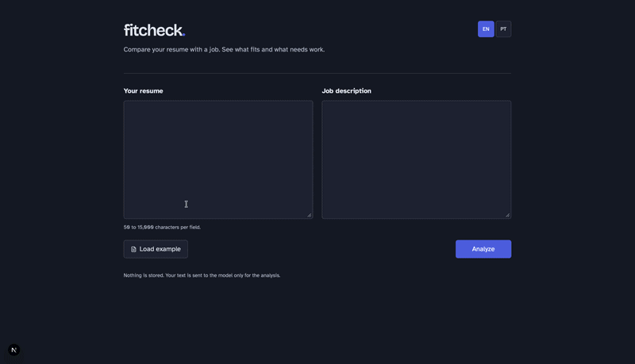

# fitcheck

Compare a resume with a job description and get a fit score, requirement evidence, missing keywords and factual rewrite suggestions. The interface supports English and Portuguese. This project started as a personal agent used day to day and became a product.

## Run locally

Use Node.js 22 and npm.

```sh
npm install
cp .env.example .env.local
npm run dev
```

Set `LLM_API_KEY`, `LLM_BASE_URL` and `LLM_MODEL` in `.env.local` before analyzing. The base URL must expose an OpenAI-compatible chat completions API. Optionally set `APP_PASSWORD` to require a password. Open http://localhost:3000 and select Load example to use fictional documents.

## Technical decisions

Next.js App Router, TypeScript, Tailwind CSS and lucide-react provide the interface. The OpenAI SDK calls the configured gateway only on the server. Zod validates structured results. A plain bilingual object supplies interface text, and localStorage stores only the language choice. Resume text and reports are not persisted by this app; the gateway's own retention policy still applies.

```sh
npm run typecheck
npm run build
npm start
```

## Validation status

Build and type checking passed during initial setup. Live model analysis and browser visual checks are still pending.

## Demo



## Next steps

Future versions may add PDF upload, saved profiles, accounts, analysis history, per-IP rate limiting, full resume generation, a database and automated tests.